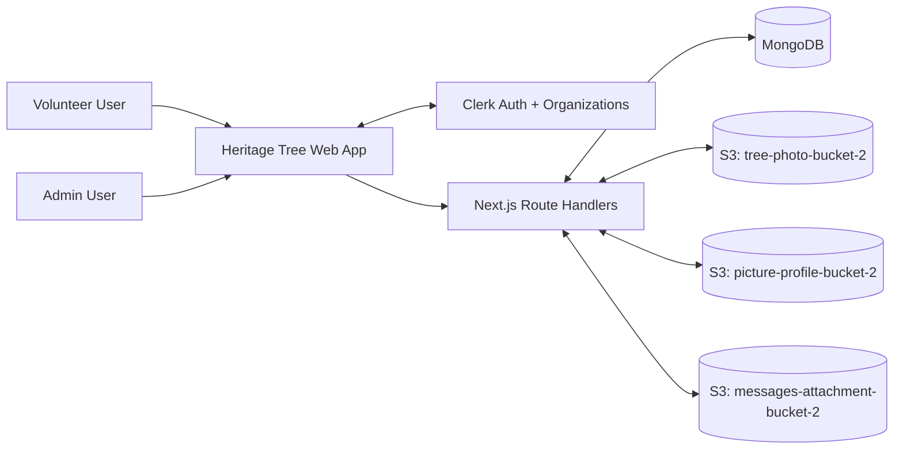
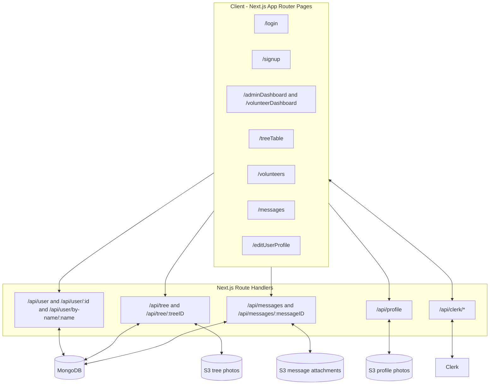
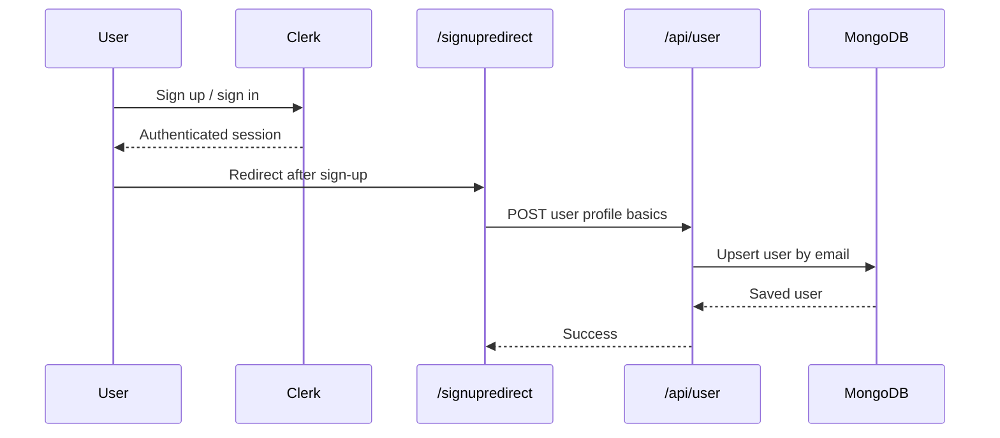
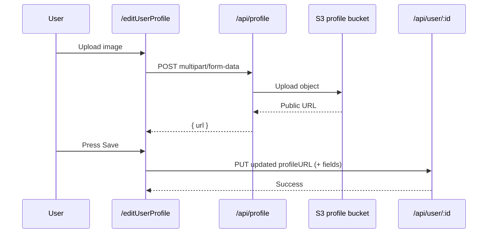
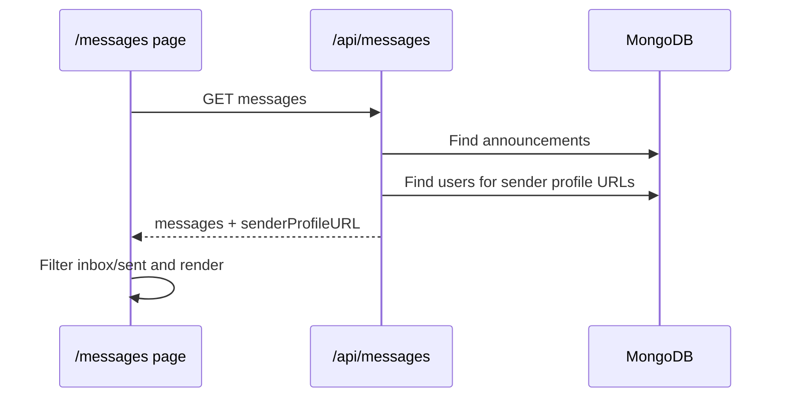

# Architecture

This document describes the project architecture using a lightweight C4 approach.

## 1) System Context

## 2) Containers and Major Components

## 3) Key Runtime Flows

### 3.1 Auth + First Login Provisioning

### 3.2 Profile Picture Update

### 3.3 Messages Read Path (Enriched Response)

## 4) Data Ownership

- `MongoDB`
  - `users` collection: profile, role, contact data, profileURL
  - `trees` collection: tree records and metadata
  - `announcements` collection: messages, recipients, read state, attachmentUrl
- `S3 buckets`
  - Tree images
  - Profile images
  - Message attachments
- `Clerk`
  - Authentication/session
  - Organization memberships and roles (`org:admin`, `org:member`)

## 5) Notes and Constraints

- Authorization in UI depends primarily on Clerk organization role.
- Some pages still include client-side filtering/pagination after full list fetches.
- APIs have started moving to enriched responses to reduce N+1 profile lookups.
